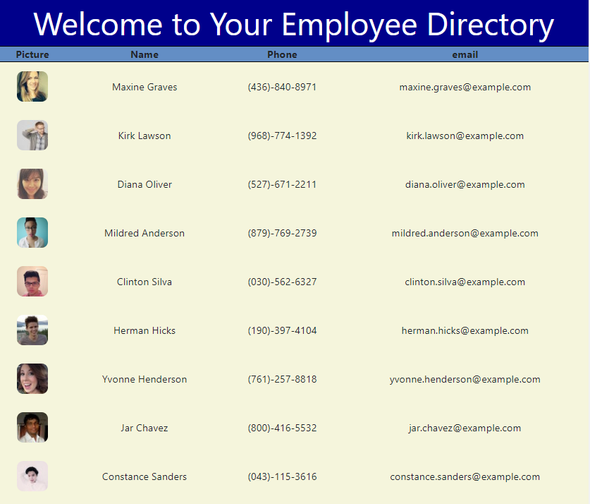

# Employee Directory

Employee information at your finger tips. 

## Deployed Link

https://mesgt.github.io/employee_directory/

# Application Details

## Purpose

Every company needs a good way to display their employee's information. This website does just that.  

## Description

Using Random User API, 25 users are displayed in a table with their photo, first and last name, phone number and email addrress. This app was put together using React Table and hooks. Some in-line and linked CSS styling add a little bit of personality to the page. 

## Technologies

<li>Random User API </li>
<li>React Table </li>
<li>Hooks </li>

## Future Development

Ideas for future development include:
* Enable employee sorting by name

## License

Licensed under the [MIT](https://opensource.org/licenses/MIT) license.

## GitHub

https://github.com/mesgt/charmeleon

## Contributing

I would like to welcome you to work with me on improving this project. Feel free to contact me on gitHub or submit a pull request.

Please note that this project is released with a Contributor Code of Conduct. 
By participating in this project you agree to abide by its terms. 

If you are interested in collaborating with me on this project, please visit (https://www.contributor-covenant.org/version/2/0/code_of_conduct/) to review the latest version of Contributor Covenant. In Node.js, please run the following command "npm install -g covgen" and "covgen '<your_email_address>'". If you have npm 5.x installed you can run npx covgen <your_email_address> instead of installing globally.
